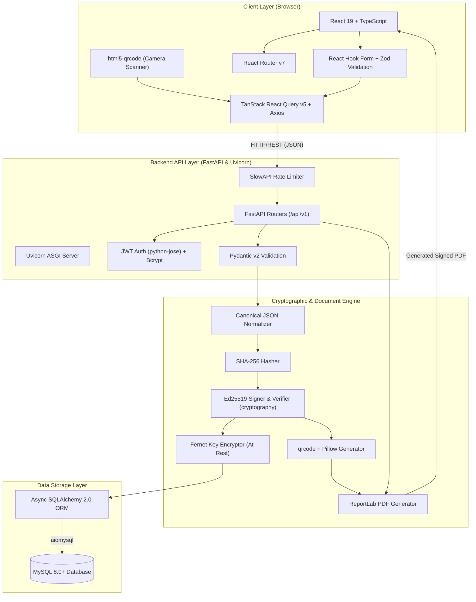

# CertiSecure2 — Technology Stack & Architecture Specification

This document details the technologies, libraries, frameworks, and architecture implemented in **CertiSecure2**.

---

## 🛠️ Technology Stack Summary

### 1. Frontend Technologies
- **React 19**: Modern UI component library for building stateful interfaces.
- **TypeScript**: Ensures strict static typing across components, models, and API response objects.
- **Vite 8**: Next-generation frontend build tool and hot-module-replacement (HMR) development server.
- **Tailwind CSS v4**: Utility-first styling framework with custom design tokens for responsive layouts and dark/light modes.
- **React Router v7**: Client-side router handling navigation across public verification, issuer dashboard, and admin pages.
- **TanStack React Query v5**: Asynchronous state management, server-state caching, and request deduplication.
- **Axios**: HTTP client for API requests with pre-configured request/response interceptors.
- **React Hook Form & Zod**: Form management and schema validation ensuring error-free input before backend submission.
- **html5-qrcode**: Browser-native camera QR scanner for instant client-side QR verification.
- **Lucide React & Recharts**: Modern icon library and responsive data visualization graphs for administrative metrics.

### 2. Backend Technologies
- **Python 3.11+**: Core programming language.
- **FastAPI**: Asynchronous, high-performance web framework providing OpenAPI auto-documentation.
- **Uvicorn**: Asynchronous Server Gateway Interface (ASGI) server running FastAPI on port 8000.
- **Async SQLAlchemy 2.0**: Object-Relational Mapping (ORM) library using `aiomysql` and `aiosqlite` engines.
- **Pydantic v2**: Data validation and setting management via Python type annotations.
- **JWT & Bcrypt**: Token-based authorization via `python-jose` and password hashing with `bcrypt` & `passlib`.
- **SlowAPI**: Rate limiting middleware for sensitive endpoints to prevent brute-force attacks.

### 3. Cryptography & Document Engine
- **Ed25519 (`cryptography`)**: High-speed, 256-bit asymmetric keypair generation, signature creation, and verification.
- **SHA-256 (`hashlib`)**: Cryptographic hashing algorithm used to derive unique 32-byte digests from canonical JSON certificate records.
- **Fernet**: Symmetric encryption algorithm protecting institutional Ed25519 private keys at rest inside MySQL.
- **ReportLab**: Dynamic PDF generation library creating multi-page, high-resolution certificates.
- **qrcode + Pillow**: High-density QR code generation embedding digital signatures and verification URLs into PDFs.

### 4. Database Storage
- **MySQL 8.0+**: Primary relational database with foreign key constraints, indexes, and ENUM types.
- **SQLite**: Local file-based database for zero-config testing and offline development.

---

## 🏗️ System Architecture Diagram

---

## 🔄 Execution Workflows

### 1. Certificate Issuance Flow
1. **Input & Validation**: User inputs certificate details in React UI; validated via Zod.
2. **API Request**: Axios sends JWT-authenticated request to FastAPI endpoint `/api/v1/certificates`.
3. **Canonical Hashing**: Backend normalizes certificate payload into a canonical JSON string and computes its SHA-256 hash.
4. **Ed25519 Signing**: Decrypts institutional private key (Fernet) and signs SHA-256 hash generating a 64-byte Ed25519 signature.
5. **Persistence**: Saves record, hash, and signature in MySQL via async SQLAlchemy.
6. **PDF & QR Generation**: ReportLab compiles PDF with an embedded QR code generated via `qrcode` + `Pillow`.

### 2. Verification Flow
1. **Scanning / Input**: Verifier inputs Certificate UID or scans QR code using `html5-qrcode`.
2. **Data Lookup**: FastAPI retrieves certificate record, current hash, and issuer's Ed25519 public key.
3. **Cryptographic Verification**: Backend re-computes SHA-256 canonical hash and verifies Ed25519 signature.
4. **Status Response**: Returns status badge (🟢 **AUTHENTIC**, 🔴 **TAMPER DETECTED**, or ⚠️ **REVOKED**) with side-by-side hash comparison.
